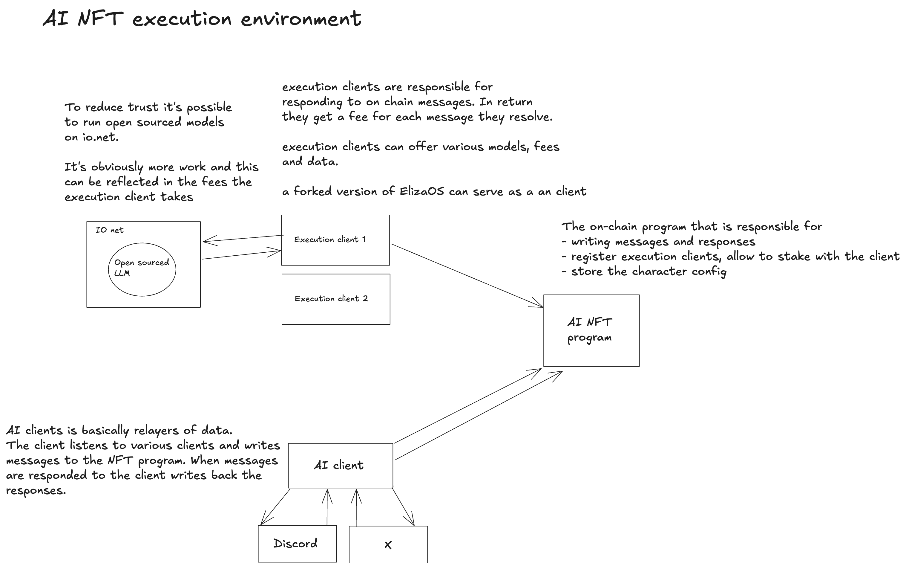

# AI NFT


## Getting started

Run the anchor integration tests
```bash 
just test 
```

In orde to run the program locally first run the test validator. 
```bash 
just start-local
```

Then run the program. 
```bash 
just deploy-local
```

Finally initialize the program 
```bash 
just init
```


## A program for creating AI agents NFTs. 

Most of the AI agents today are a program that takes input an combines the data with previous seen data for then to send it to a model provider like openai or anthropic. Part of the prompt is also instructions on how the agent should behave. You can launch yur own agent on all cloud platforms. One remaining problem is: Who pays for the compute? 

As of now the owner of the AI agent pays for the compute. This is fine in the beginning but as the agent becomes more popular the owner will have to pay more and more. In crypto we've seen that tokens has been deployed together with the AI agent. However, this is not a good solution. There are no value accrual to the token holders based on the usage of the agent. At the same time the owner of the agent will sell their initial supply to fund the compute. This leads to token holders lossing value. 

## Solution

If AI agents are to thrive and be useful we need a better economic model. We need a way for the agent and the owner of the agent to accrue value beyond the cost of the compute. In order to achieve this the agent needs to provide more value to the user than a chat window. To make this happen we need to create a platform for developers to experiment and iterate on the agents. 

## aiNFT
AI NFT is the first step in that direction. The project sets out to create the first AI NFT protocol on Solana. The project will act as a basis for a agent platform. 

As of now the project supports a three actor system

- The client: which interacts with the on chain program. The client isn responsible for consuming inputs and sending outputs.
- The program: The program runs on chain and stores the state of the agent, the ownership of the agent and the configuration of the agent. The message log is also stored on chain.
- The execution layer: Anybody can launch their own execution layer. The execution layer is a service that reads messages per on chain agents. It then combines the message with the on chain character config, agent history and other context. When the execution client writes a response a token is paid. Owner of the clients can charge extra for services like increased context or priority. 

## The program

The on chain program have some interesting economic features implemented. These are

- When the program is initialized a program specific token mint is created. It allows the owner of the program to mint a supply and potential distribute it to the NFT owners. The token is used to pay the execution client for the compute.
- Each AI Agent NFT can pick which client to use and change it at any time. 
- The owner of an AI Agent NFT can at any time update the agent and sell the agent as a NFT

## Improvements

- As of now anybody can send messages to the agent and its free. The assumption is that users will tip agents at discrete points in time. This might prove wrong. In this case the users should pay the same mint as the execution client charges in. 
- NFT specific mint: Right now the program has a global mint. This means that the mint is the same for all agents. This might prove to be a problem. 


## Architecture 
The architecture is show below with the three different actors. 




# Program instructions

1. Initialize aiNFT program. The payer will be the owner of the program. The owner has the ability to 
- Set default values for minted aiNFTS. 
- Set the default execution layer. 
- Set the default model. 
- Set the default personality. 
- Set the default knowledge base. 
- Set the default actions. 
- Decide the price of minting an aiNFT. 

2. Create an MPL compliant collection of aiNFTS. 

3. Mint token to pay for off chain compute. Token will be minted evey time a new aiNFT is minted. Every time the response is written some of the tokens are tranferred to the off chain service. 

4. Mint an aiNFT. This is open for everyone. The minted aiNFT will be configured with the default values set in the initialize instruction. 

5. Top up the aiNFT. This is open for everyone. The aiNFT will use this to 
pay for off chain compute. 

## Communicate
 
6. Send messages to the aiNFT. This is open for everyone. The message is created as an account. The answer to the message will be written to the same account and is thus final. The aiNFT will generate its own context based on on-chain data. 

7. Generated response. The execution layer is allowed to write to this account. Inside this instruction response validation is done. The response is written to the same account as the message. There are also generated accounts for the actions. If the actions are on chain these are executed. The off chain actions will be picked up by an off chain service that will communicate the actions to the off chain service. It's up the owner of the aiNFT to decide how this should be handled. 

8. Donate. Anyone can donate to the aiNFT. This is funds that the aiNFT will receive. The aiNFT will be able to use this to pay for actions. 

9. Transfer aiNFT. Allow the holder of the aiNFT to transfer it to another account. 

# TODO
[x] Allow user to attach compute to aiNFT
[ ] Use on-chain config to build the prompt  
[ ] Implement support for mongodb for storing data to build prompt 
[ ] Allow AI to generate actively make choices
[ ] Make on chain actions from execution client
